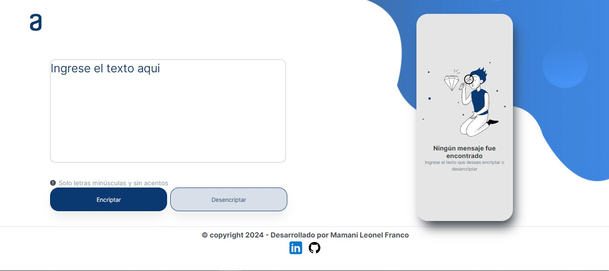

# Encriptador de Texto

Este proyecto consiste en una página web que permite encriptar y desencriptar mensajes de texto ingresados por el usuario. Es totalmente responsive, adaptándose correctamente a dispositivos móviles.

## Funcionalidades

- **Encriptar y Desencriptar:** Utilizando únicamente letras minúsculas y sin acentos.
- **Interfaz Intuitiva:** Interfaz dividida en dos secciones para ingresar y mostrar resultados.
- **Copiar Resultados:** Opción para copiar el texto encriptado o desencriptado.

## Capturas de Pantalla

## Tecnologías Utilizadas

- HTML
- CSS
- JavaScript

## Uso

- Ingresa a esta web: [Enlace del encriptador](https://leoma23.github.io/challenge-encriptador/)

